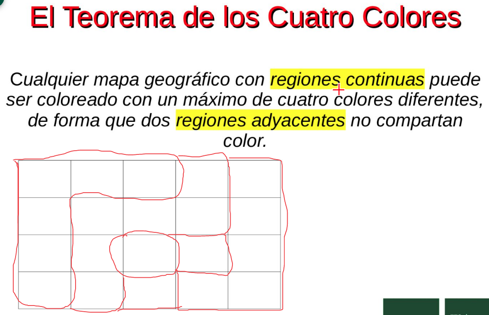
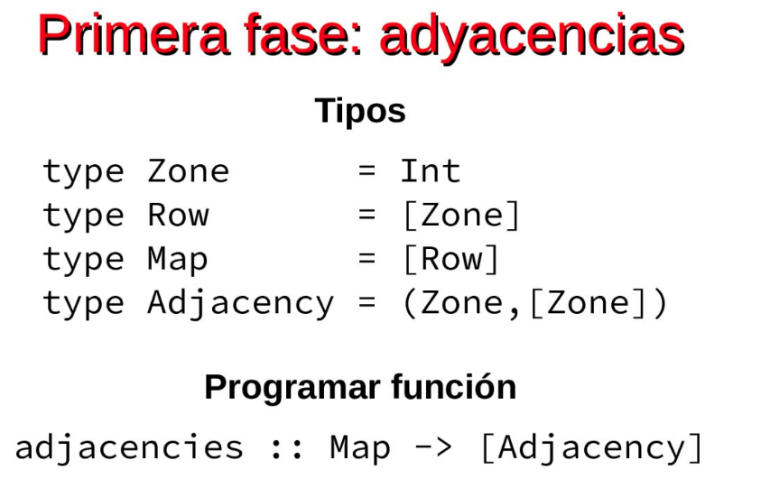
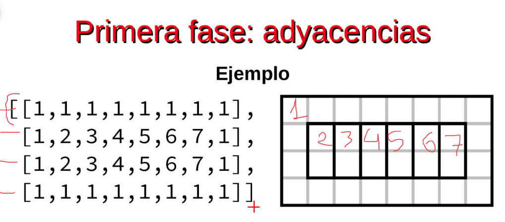
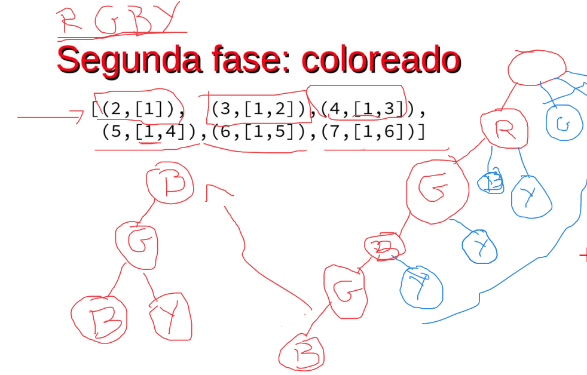
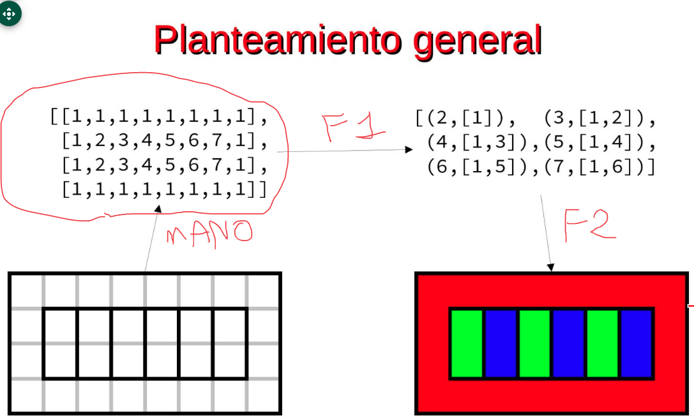

# Práctica

- No se permiten enclaves (territorios totalmente rodeados por otros territorios).

- La primera zona es la 2.

- (2[1]), (3.[1,2]),(4,[1,3])
- Ver video de como transformar un bucle en una función recursiva. https://www.youtube.com/watch?v=ZjmYwdnK6jM

- la función takeFirst es una subfunción de color que usa la evaluación perezosa para sacar la primera solución que encuentre en su evaluación.
- El resultado es una lista de nodos solución.

- Existen mapas que no tienen solución, pero no cumplirían las restricciones.
- Por consola mostraremos 